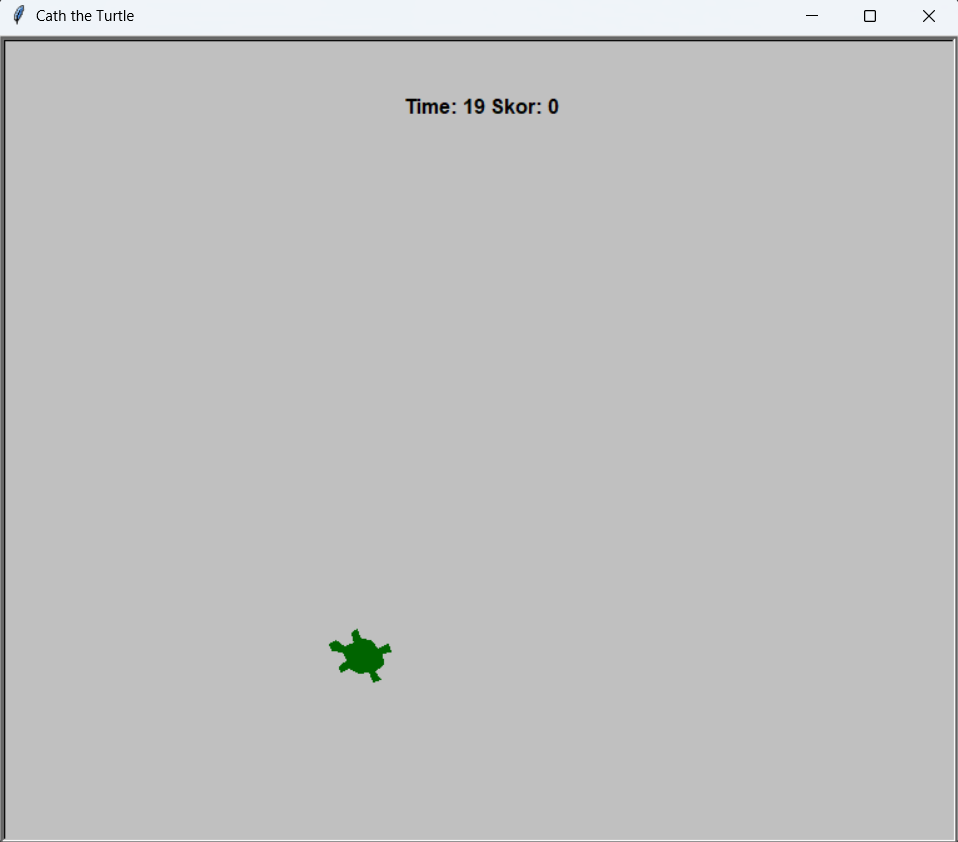
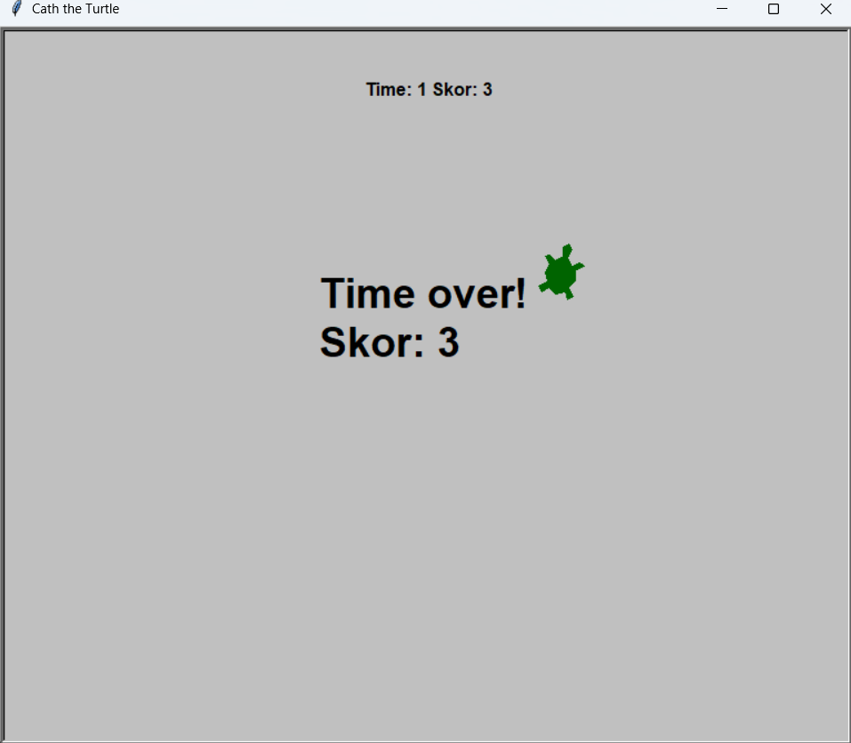

@"
# 🐢 Catch the Turtle

Ekranda rastgele zıplayan kaplumbağayı **süre dolmadan** yakala; her tık **+1 skor**. Basit, hızlı, eğlenceli.

## 🎮 Ekran Görüntüleri

  
  

## 🚀 Çalıştırma
python main.py
"@ | Out-File -Encoding UTF8 README.md
